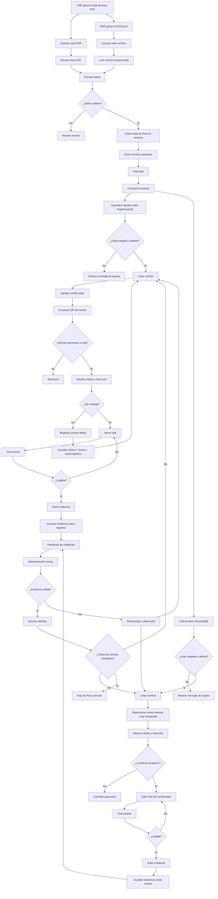

# Logística WebApp — Captura de Conformados por Hoja de Ruta

Sistema externo de trazabilidad diseñado para capturar evidencia de entregas (conformados) sin intervención manual sobre datos críticos.

El sistema se integra de forma desacoplada con el ERP, utilizando documentos existentes (PDF o exportables) como fuente de datos.

---

## 🎯 Objetivo

- Evitar carga manual de datos
- Reducir errores humanos
- Permitir carga de evidencia desde logística y cliente
- Registrar trazabilidad completa de entregas
- No depender de APIs del ERP

---

## 🧠 Principio clave

> La Hoja de Ruta define el universo de remitos válidos.

---

## 🎨 Frontend y UX

- Todos los templates deben implementarse con enfoque mobile-first.
- El flujo principal de uso operativo se prioriza para celular.
- Bootstrap CSS y Bootstrap JS deben servirse desde archivos locales en `static/`.
- Solo `bootstrap-icons` puede usarse por CDN.

---

## 🧩 Fuentes de datos (ingestión)

El sistema debe soportar dos formas de ingreso de datos:

---

### 🔵 Opción 1 — PDF (implementación inmediata)

El ERP ya genera un PDF como este:

:contentReference[oaicite:1]{index=1}

Ejemplo de datos detectables:

- Hoja de Ruta: `ER0010013728`
- Fecha: `23/4/2026`
- Cliente: `MINISTERIO DE SALUD CORDOBA`
- Subcliente: `OCASA`
- Remito: `00008-00021173`
- Dirección: `AV VELEZ SARSFIELD 2311`
- Transporte: `ALTA CORDOBA S.R.L.`
- Chofer: `VELIS SEBASTIAN`

#### Flujo:

```text
Usuario sube PDF
↓
Script extrae texto
↓
Parser interpreta estructura
↓
Sistema muestra previsualizacion para confirmar
↓
Sistema conserva temporalmente el archivo previsualizado
↓
Se crea Hoja de Ruta
↓
Se crean remitos asociados
```

---

### 🟢 Opción 2 — Excel / CSV (futuro recomendado)

Formato esperado:

```text
oid,nro_entrega,fecha,cliente,subcliente,remito,remito_oid,direccion,transporte,chofer
```

`oid` identifica la Hoja de Ruta y `remito_oid` identifica el remito individual que viene en el QR fisico del remito.

En el portal publico, el escaneo QR busca por `remito_oid`; la busqueda manual sigue usando el numero visible del remito, por ejemplo `00009-00022221`.
Cuando el PDF de hoja de ruta incluya una columna de OID del remito, ese valor debe cargarse como `remito_oid` para asociarlo al QR fisico.
Si el PDF corta visualmente el UUID del remito en dos lineas, el importador debe reconstruirlo antes de validar.

#### Flujo:

```text
Usuario sube archivo
↓
Sistema valida formato
↓
Sistema muestra previsualizacion para confirmar
↓
Sistema conserva temporalmente el archivo previsualizado
↓
Sistema crea Hoja de Ruta y remitos
```

---

## 🔑 Identificador de Hoja de Ruta

Se utilizará el `oid` del ERP como identificador principal.

Ejemplo:

```text
66D4FF99-0081-4D15-B04D-37B51C26DBAE
```

---

## 🌐 URLs de acceso

### Logística

```text
/conformados/logistica/{oid}
```

### Cliente

```text
/conformados/cliente/{oid}
```

---

## ⚠️ Regla de acceso

- Si la hoja NO existe → mensaje de espera
- Si la hoja está cerrada → acceso bloqueado
- Si está abierta → acceso permitido

---

## 📦 Modelo de datos

### HojaRuta

- oid
- nro_entrega
- fecha
- transporte
- chofer
- estado (abierta / cerrada)

### Remito

- id
- hoja_ruta_oid
- numero
- cliente
- direccion
- estado

### Evidencia

- id
- remito_id
- hoja_ruta_oid
- canal (logistica / cliente / interno)
- archivo_url
- fecha_carga
- validacion_estado

### IntentoEntrega

- id
- remito_id
- hoja_ruta_oid
- motivo
- comentario
- fecha

---

## 📲 Flujo de uso (operador logístico)

```text
1. Escanea QR de la Hoja de Ruta
2. Abre /conformados/logistica/{oid}
3. Ve listado de remitos
4. Toca "Agregar conformado"
5. Escanea QR del remito físico
6. Sistema filtra el remito
7. Muestra cliente + dirección
8. Usuario confirma visualmente
9. Sube foto
```

---

## 🔍 QR del remito

Ejemplo:

```text
66D4FF99-0081-4D15-B04D-37B51C26DBAE
```

Uso:

- NO abre URL
- SOLO identifica el remito dentro de la hoja
- debe coincidir con la columna `remito_oid` importada por Excel/CSV

Regla:

> Para operar con escaneo de QR del remito, el importador Excel/CSV debe traer `remito_oid`. El PDF visible por si solo no alcanza si no contiene ese identificador por remito.

---

## ✔️ Validación clave

```text
Si remito escaneado ∉ hoja de ruta
→ rechazar operación
```

---

## ✍️ Entrada manual (fallback)

Si falla la cámara:

- permitir ingresar número de remito
- mostrar advertencia

El escaneo desde móvil debe guiar al operador con un cuadro central para apuntar el QR, priorizar la lectura de esa zona y mantener la entrada manual como respaldo.
La entrada manual debe validar el formato `00009-00022221` o 13 digitos sin guion y explicar si faltan o sobran digitos.

---

## ❌ No entregado

Permitir registrar:

- motivo
- comentario
- fecha/hora

---

## 🔁 Reintentos

Cada intento fallido se guarda:

```text
Remito
 ├ intento 1
 ├ intento 2
 └ evidencia final
```

---

## 📸 Carga de evidencia

Flujo:

```text
Seleccionar remito
↓
Tomar foto
↓
Vista previa obligatoria
↓
Confirmación de legibilidad
↓
Subir
```

---

## ⚠️ Advertencia obligatoria

```text
Si la imagen no es legible, será rechazada.
```

---

## 🔄 Duplicados

Si ya hay evidencia:

```text
Ya existe una evidencia
¿Desea cargar otra?
```

NO bloquear.

---

## 🧑‍💼 Validación administrativa

Estados:

- validado
- observado
- rechazado

---

## 🔒 Seguridad (fase actual)

Se utiliza:

```text
/conformados/{canal}/{oid}
```

El `oid` es difícil de adivinar pero no es un token seguro.

---

## 📌 Regla final

```text
ERP → genera datos
Sistema → estructura
Link → opera
QR remito → filtra
Admin → valida
```

---

## Estado inicial implementado

Se inicializo una base Django funcional con:

- proyecto `config` y app `tracking`
- modelos: `HojaRuta`, `Remito`, `Evidencia`, `IntentoEntrega`, `EventoTrazabilidad`
- admin registrado para entidades principales
- endpoints iniciales:
    - `/` (redirecciona al panel)
    - `/accounts/login/`
    - `/accounts/logout/`
    - `/panel/`
    - `/panel/permisos/`
    - `/panel/usuarios/`
    - `/panel/usuarios/nuevo/`
    - `/panel/usuarios/<id>/editar/`
    - `/panel/usuarios/<id>/eliminar/`
    - `/panel/importar/pdf/`
    - `/panel/importar/excel/`
    - `/panel/evidencias/`
    - `/panel/evidencias/<id>/validar/`
    - `/panel/hojas/<oid>/cerrar/`
    - `/conformados/<canal>/<oid>/`
    - `/conformados/<canal>/<oid>/subir/`
    - `/conformados/<canal>/<oid>/no-entregado/`
- templates basicos para panel y portal publico
- login interno de usuarios
- gestion de usuarios internos con rol (`deposito`, `ventas`, `jefe`, `otro`)
- CRUD de usuarios internos desde panel (listar, crear, editar, eliminar)
- permisos por rol para compartir links:
    - deposito: logistica
    - ventas: cliente
    - jefe: ambos
- permisos internos por accion:
    - importar PDF: deposito o jefe
    - revisar/validar evidencias: jefe
    - cerrar hoja: jefe
    - gestionar usuarios: staff, superuser o jefe
    - otorgar/quitar `is_staff`: solo superuser
- importador PDF inicial con extraccion de texto, lectura de QR y creacion de `HojaRuta` + `Remito`
- validacion estricta de importacion PDF:
    - exige OID en QR/link
    - exige fecha valida
    - exige cantidad minima de remitos (configurable por `IMPORT_MIN_REMITOS`)
    - exige campos obligatorios por remito (`numero`, `cliente`, `direccion`)
    - bloquea duplicados de remito dentro de la misma hoja
- flujo publico inicial para cargar evidencia y registrar no entregado con trazabilidad
- validacion de remito escaneado en portal publico contra remitos de la hoja (con normalizacion de formato)
- importacion adicional de Excel/CSV usando las mismas reglas de dominio que PDF
- correccion de parser de fechas en PDF para evitar falsos positivos como "Cliente"
- el importador PDF ahora lee filas de tabla usando `Fecha + Remito + Direccion` para evitar confundir telefono/CUIT con remitos
- revision administrativa inicial de evidencias con validacion, observacion o rechazo
- cierre operativo de hojas de ruta desde panel interno
- settings modulares en `config/settings/` (`base.py`, `development.py`, `production.py`)
- settings adicional `config/settings/railway.py` para despliegue en Railway
- desarrollo local con SQLite y archivos locales
- deploy en Railway con PostgreSQL y storage S3 compatible

Tambien se genero la migracion inicial:

- `tracking/migrations/0001_initial.py`

---

## Arranque rapido

1. Instalar dependencias:

```bash
pip install -r requirements.txt
```

2. Configurar entorno:

```bash
cp .env.example .env
```

Configuracion local recomendada:

```bash
DJANGO_SETTINGS_MODULE=config.settings.development
```

Configuracion para Railway:

```bash
DJANGO_SETTINGS_MODULE=config.settings.railway
```

3. Generar y aplicar migraciones:

```bash
python manage.py migrate
```

4. Ejecutar servidor:

```bash
python manage.py runserver
```

---

## Deploy Railway

Variables minimas:

```text
DJANGO_SETTINGS_MODULE=config.settings.railway
DJANGO_SECRET_KEY=valor-seguro
DJANGO_DEBUG=0
RAILWAY_PUBLIC_DOMAIN=tu-dominio.up.railway.app
DJANGO_SECURE_SSL_REDIRECT=1
DJANGO_SECURE_HSTS_SECONDS=0
DJANGO_RUN_STARTUP_COMMANDS=1
WHITENOISE_USE_FINDERS=1
RAILWAY_CHECK_DB_ON_READY=0
```

Base de datos. La app acepta `DATABASE_URL` o las variables `PG*` que genera Railway:

```text
PGDATABASE=...
PGHOST=...
PGPASSWORD=...
PGPORT=...
PGUSER=...
```

Variables privadas para crear el primer admin durante deploy:

```text
INITIAL_ADMIN_USERNAME=ivelazquez
INITIAL_ADMIN_PASSWORD=<definir-en-railway>
INITIAL_ADMIN_EMAIL=
```

Variables para bucket S3 compatible:

```text
BUCKET_ACCESS_KEY_ID=...
BUCKET_SECRET_ACCESS_KEY=...
BUCKET_NAME=...
BUCKET_REGION=...
BUCKET_ENDPOINT=...
```

El `Procfile` ejecuta:

```text
python manage.py migrate && python manage.py ensure_initial_admin && python manage.py collectstatic --noinput && python -m gunicorn config.wsgi:application --bind 0.0.0.0:$PORT
```

`ensure_initial_admin` solo crea el usuario inicial si `INITIAL_ADMIN_PASSWORD` esta configurada y el usuario no existe. Si `ivelazquez` ya existe, no cambia la clave ni permisos.

`railway.json` fuerza en Railway:

```text
build: python manage.py collectstatic --noinput
start: python manage.py migrate --noinput && python manage.py ensure_initial_admin && python -m gunicorn config.wsgi:application --bind 0.0.0.0:$PORT
```

Regla:

> En Railway se debe usar PostgreSQL y bucket para archivos cargados. SQLite y filesystem local quedan solo para desarrollo local.


